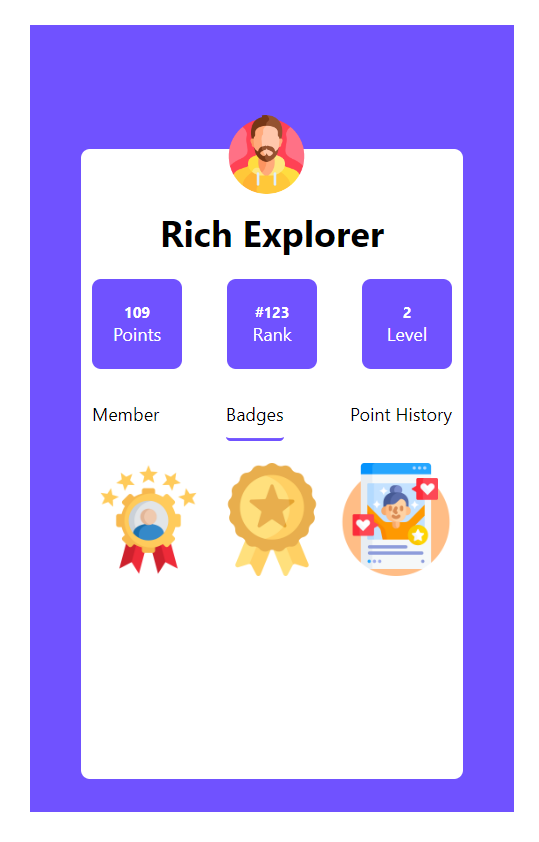
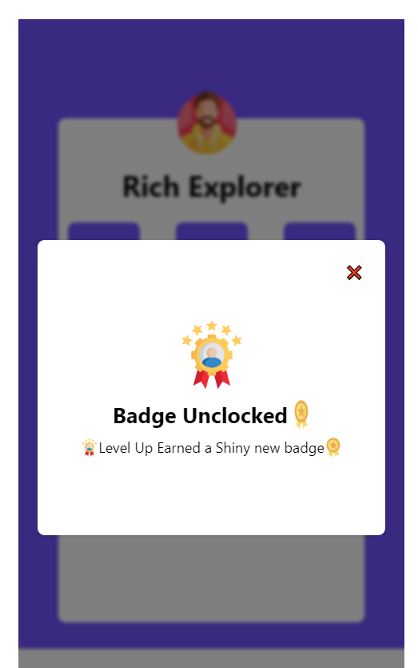

# Quest_Labs_Assignment

Welcome to the Quest Labs assignment. 

## Table of Contents

- [About](#about)
- [Features](#features)
- [Getting Started](#getting-started)
- [Usage](#usage)
- [Technologies Used](#technologies-used)
- [Deployment](#deployment)
- [Contributing](#contributing)
- [License](#license)

## About

Ques_Labs is a assignment for the user profile

## Features

- Modals for Badges.
- api call for badges images

## Screenshots

## Deployment

Deployed Link:-https://quest-gamma.vercel.app/

## Getting Started

# Clone the repository

git clone https://github.com/mohdadil12345/Quest

# Change directory

cd your-repo

# Install dependencies

npm install

# Start the development server

npm start

## Technologies Used

- Quest_Labs   is built using the following technologies:

- React.js
- scss
- fetch
- vercel

## Usage

- Visit the application in your web browser at http://localhost:3000 or the URL https://quest-gamma.vercel.app/.
